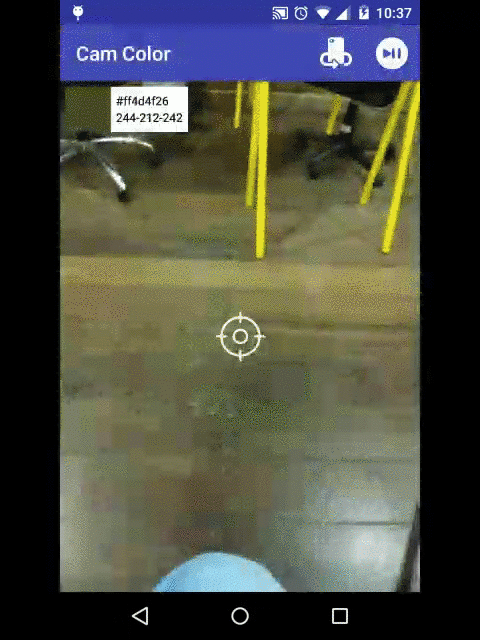

# Cam-Color
This library allows you to obtain the hexadecimal or RGB code of the color of any image through the camera. 
You can switch between the rear or front camera.
</br>
</br>

# Sample Project
You can download the latest sample APK from this repo here: https://github.com/rodLibs/cam-color/blob/master/sample/cam%20color.apk
</br>
</br>


# Requirements
cam-color requires at minimum Android 2.3.3 (API level 10).
</br>
</br>


# Gradle Dependency

## Repository
The Gradle dependency is available via maven. maven is the default Maven repository used by Android Studio.
</br>

## Add repository
<pre><code>
repositories {
    maven {
        url  "https://dl.bintray.com/rod120/cam-color" 
    }
}
</code></pre>


## Add dependency

#### Gradle:
<pre><code>
  implementation 'com.github.rodlibs:cam-color:2.0'
</code></pre>


#### Maven:
```xml
 <dependency>
   <groupId>com.github.rodlibs</groupId>
   <artifactId>cam-color</artifactId>
   <version>2.0</version>
   <type>pom</type>
</dependency>
```
</br>
</br>


# Sample usage
#### .java
<pre><code>
 FrameLayout frameLayout = (FrameLayout)findViewById(R.id.camera_preview);
 CamPickerColor cam = new CamPickerColor(MainActivity.this,frameLayout);
</code></pre>

###### Listener that will return the hexadecimal or RGB of the color captured by the camera. 

<pre><code>
 cam.setListener(new ColorListener() {
            @Override
            public void getColorHexadec(String s) {
              //returns the color hexadecimal.
            }
            @Override
            public void getColorRGB(int r, int g, int b) {
                //returns the color RGB.
            }
            @Override
            public void getColor(int i) {
                //returns the color code int.
            }
        });
</code></pre>

###### Release and resume camera.
<pre><code>
  @Override
    protected void onResume() {
        super.onResume();
        cam.createCamera();
    }
  
  @Override
    protected void onPause() {
        super.onPause();
        cam.destroyCamera();
    }
</code></pre>


#### .kt
<pre><code>
  var frameLayout = findViewById<FrameLayout>(R.id.camera_preview)
  var cam = CamPickerColor(this@MainActivity, frameLayout)
</code></pre>

###### Listener that will return the hexadecimal or RGB of the color captured by the camera. 
<pre><code>
  cam.setListener(object : ColorListener {
            override fun getColorHexadec(s: String) {
                //returns the color hexadecimal.
            }
            override fun getColorRGB(r: Int, g: Int, b: Int) {
                //returns the color RGB.
            }
            override fun getColor(i: Int) {
                //returns the color code int.
            }
        })
</code></pre>

###### Release and resume camera.
<pre><code>
   override fun onResume() {
        super.onResume()
        cam.createCamera()
    }
    override fun onPause() {
        super.onPause()
        cam.destroyCamera()
    }
</code></pre>


#### .xml
```xml
  <FrameLayout
      android:id="@+id/camera_preview"
      android:layout_width="match_parent"
      android:layout_height="match_parent" />
```


#### Permission - Manifest
```xml
  <uses-permission android:name="android.permission.CAMERA"/>
```

<pre><code>
  OBS: Ask for camera permissions at runtime for android versions above api 23.
</code></pre>
</br>


# Api Methods
 <pre><code>
  createCamera();  -->> create camera and set in frame layout.
</code></pre>

<pre><code>
  destroyCamera();  -->> destroy and release camera.
</code></pre>

<pre><code>
  setCameraBack();  -->> switch to rear camera.
</code></pre>

<pre><code>
  setCameraFront();  -->> switch to front camera.
</code></pre>

<pre><code>
  pause();   -->>  Pause the camera, freezing the image and the color values.
</code></pre>

<pre><code>
  resume(); -->>  resumes the camera, releasing the image and color values.
</code></pre>
</br>


# License
<pre><code>
Licensed under the Apache License, Version 2.0 (the "License");
you may not use this file except in compliance with the License.
You may obtain a copy of the License at

   http://www.apache.org/licenses/LICENSE-2.0

Unless required by applicable law or agreed to in writing, software
distributed under the License is distributed on an "AS IS" BASIS,
WITHOUT WARRANTIES OR CONDITIONS OF ANY KIND, either express or implied.
See the License for the specific language governing permissions and
limitations under the License.
</code></pre>

